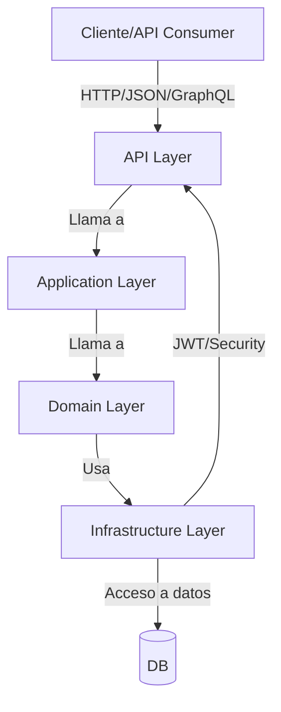
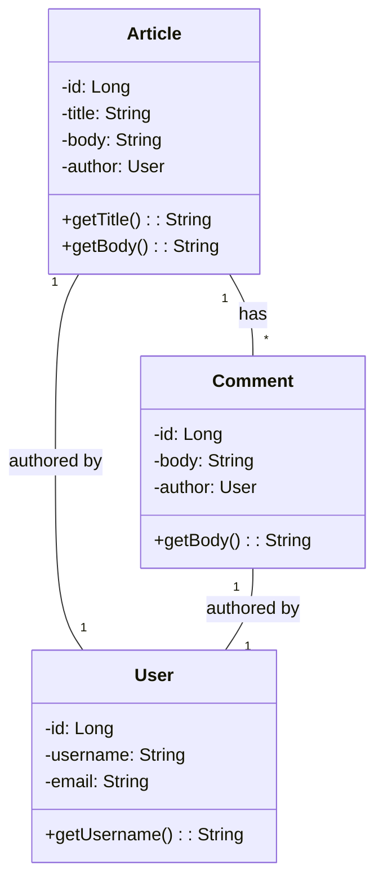
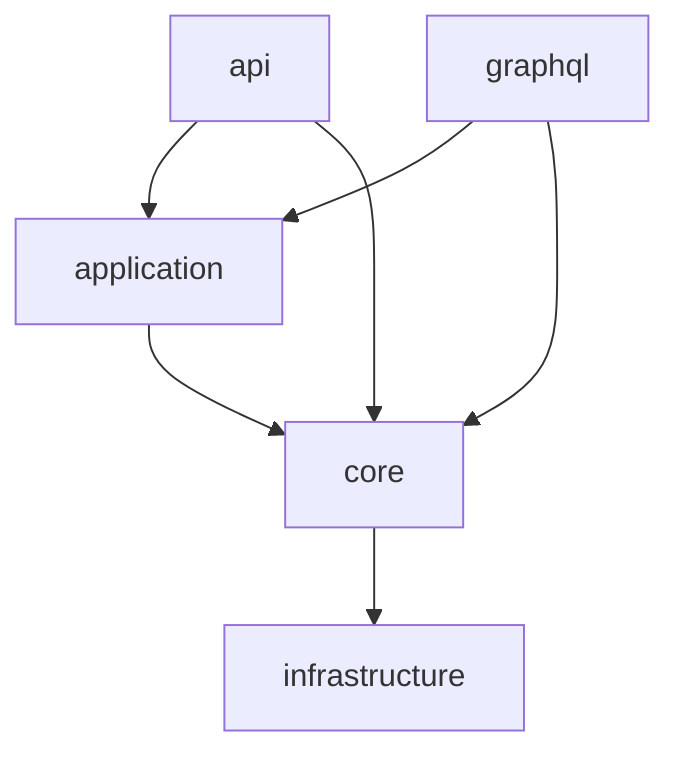
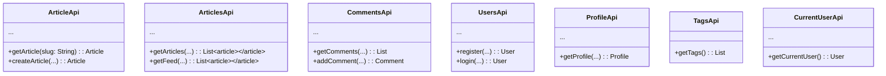
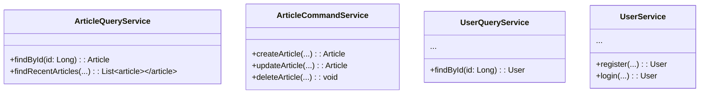
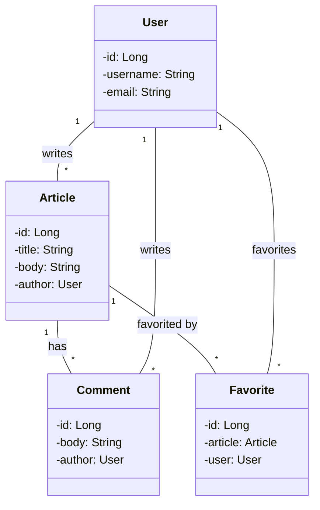
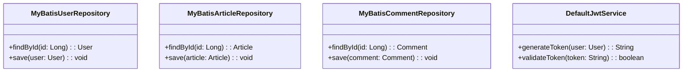
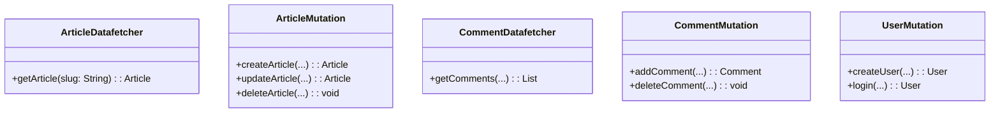

# Estructura de carpetas y archivos del backend

> **Leyenda:**
> - `//` Comentario explicando la función del archivo

## Estructura general

```
root/
│   build.gradle                // Configuración de Gradle
│   gradlew                     // Wrapper de Gradle (Unix)
│   gradlew.bat                 // Wrapper de Gradle (Windows)
│   README.md                   // Documentación principal
│   LICENSE                     // Licencia del proyecto
│   example-logo.png            // Logo de ejemplo
│
├── gradle/
│   └── wrapper/
│       ├── gradle-wrapper.jar          // Binario del wrapper
│       └── gradle-wrapper.properties   // Configuración del wrapper
│
├── src/
│   ├── main/
│   │   ├── java/
│   │   │   └── io/
│   │   │       └── spring/
│   │   │           │   JacksonCustomizations.java      // Configuración de serialización JSON
│   │   │           │   MyBatisConfig.java              // Configuración de MyBatis
│   │   │           │   RealWorldApplication.java       // Clase principal Spring Boot
│   │   │           │   Util.java                      // Utilidades generales
│   │   │           │
│   │   │           ├── api/                           // Controladores REST
│   │   │           │   ├── ArticleApi.java            // Endpoints REST para artículo (CRUD)
│   │   │           │   ├── ArticleFavoriteApi.java     // Endpoints para favoritos de artículos
│   │   │           │   ├── ArticlesApi.java            // Endpoints para listado y feed de artículos
│   │   │           │   ├── CommentsApi.java            // Endpoints para comentarios
│   │   │           │   ├── CurrentUserApi.java         // Endpoints para usuario autenticado
│   │   │           │   ├── ProfileApi.java             // Endpoints para perfiles de usuario
│   │   │           │   ├── TagsApi.java                // Endpoints para tags
│   │   │           │   ├── UsersApi.java               // Endpoints para registro y login
│   │   │           │   └── security/
│   │   │           │       └── WebSecurityConfig.java  // Configuración de seguridad Spring Security
│   │   │           │   └── exception/
│   │   │           │       └── CustomizeExceptionHandler.java // Manejo global de excepciones REST
│   │   │           │
│   │   │           ├── application/                    // Servicios de aplicación y queries
│   │   │           │   ├── ArticleQueryService.java    // Consultas de artículos
│   │   │           │   ├── CommentQueryService.java    // Consultas de comentarios
│   │   │           │   ├── CursorPageParameter.java    // Parámetros de paginación
│   │   │           │   ├── CursorPager.java            // Lógica de paginación
│   │   │           │   ├── DateTimeCursor.java         // Cursor de fecha para paginación
│   │   │           │   ├── Node.java                   // Nodo base para paginación
│   │   │           │   ├── Page.java                   // Objeto de página
│   │   │           │   ├── PageCursor.java             // Cursor de página
│   │   │           │   ├── ProfileQueryService.java    // Consultas de perfiles
│   │   │           │   ├── TagsQueryService.java       // Consultas de tags
│   │   │           │   ├── UserQueryService.java       // Consultas de usuarios
│   │   │           │   ├── article/
│   │   │           │   │   └── ArticleCommandService.java // Comandos de artículos (crear, actualizar, eliminar)
│   │   │           │   ├── data/
│   │   │           │   │   └── ... (otros DTOs y utilidades de datos)
│   │   │           │   └── user/
│   │   │           │       └── UserService.java        // Lógica de negocio de usuarios
│   │   │           │
│   │   │           ├── core/                           // Entidades y lógica de dominio
│   │   │           │   ├── article/
│   │   │           │   │   └── Article.java            // Entidad Artículo
│   │   │           │   ├── comment/
│   │   │           │   │   └── Comment.java            // Entidad Comentario
│   │   │           │   ├── favorite/
│   │   │           │   │   └── Favorite.java           // Entidad Favorito
│   │   │           │   ├── service/
│   │   │           │   │   └── JwtService.java         // Servicio de JWT
│   │   │           │   └── user/
│   │   │           │       └── User.java               // Entidad Usuario
│   │   │           │       └── UserRepository.java     // Interfaz de repositorio de usuario
│   │   │           │
│   │   │           ├── graphql/                        // Controladores y datafetchers GraphQL
│   │   │           │   ├── ArticleDatafetcher.java     // Datafetcher de artículos
│   │   │           │   ├── ArticleMutation.java        // Mutaciones de artículos
│   │   │           │   ├── CommentDatafetcher.java     // Datafetcher de comentarios
│   │   │           │   ├── CommentMutation.java        // Mutaciones de comentarios
│   │   │           │   ├── MeDatafetcher.java          // Datafetcher de usuario actual
│   │   │           │   ├── ProfileDatafetcher.java     // Datafetcher de perfiles
│   │   │           │   ├── RelationMutation.java       // Mutaciones de relaciones
│   │   │           │   ├── SecurityUtil.java           // Utilidades de seguridad para GraphQL
│   │   │           │   ├── TagDatafetcher.java         // Datafetcher de tags
│   │   │           │   ├── UserMutation.java           // Mutaciones de usuario
│   │   │           │   └── exception/
│   │   │           │       └── GraphQLCustomizeExceptionHandler.java // Manejo de errores GraphQL
│   │   │           │
│   │   │           └── infrastructure/                 // Implementaciones técnicas
│   │   │               ├── mybatis/
│   │   │               │   └── ... (configuración y utilidades de MyBatis)
│   │   │               ├── repository/
│   │   │               │   ├── MyBatisUserRepository.java         // Implementación de repositorio de usuario
│   │   │               │   ├── MyBatisCommentRepository.java      // Implementación de repositorio de comentarios
│   │   │               │   ├── MyBatisArticleRepository.java      // Implementación de repositorio de artículos
│   │   │               │   ├── MyBatisArticleFavoriteRepository.java // Implementación de repositorio de favoritos
│   │   │               │   └── ... (otros repositorios)
│   │   │               ├── service/
│   │   │               │   └── DefaultJwtService.java             // Implementación de servicio JWT
│   │   │               └── ... (otros servicios y utilidades)
│   │   │
│   │   └── resources/
│   │       ├── application.properties                // Configuración principal
│   │       ├── application-test.properties           // Configuración de tests
│   │       ├── db/
│   │       │   └── migration/
│   │       │       └── V1__create_tables.sql         // Script de migración inicial
│   │       ├── mapper/
│   │       │   ├── ArticleFavoriteMapper.xml         // Mapper MyBatis para favoritos
│   │       │   ├── ArticleFavoritesReadService.xml   // Mapper de lectura de favoritos
│   │       │   ├── ArticleMapper.xml                 // Mapper de artículos
│   │       │   ├── ArticleReadService.xml            // Mapper de lectura de artículos
│   │       │   ├── CommentMapper.xml                 // Mapper de comentarios
│   │       │   ├── CommentReadService.xml            // Mapper de lectura de comentarios
│   │       │   ├── TagReadService.xml                // Mapper de lectura de tags
│   │       │   ├── TransferData.xml                  // Mapper de transferencia de datos
│   │       │   ├── UserMapper.xml                    // Mapper de usuarios
│   │       │   ├── UserReadService.xml               // Mapper de lectura de usuarios
│   │       │   └── UserRelationshipQueryService.xml  // Mapper de relaciones de usuario
│   │       └── schema/
│   │           └── schema.graphqls                   // Esquema GraphQL
│   │
│   └── test/
│       └── java/
│           └── io/
│               └── spring/
│                   ├── RealworldApplicationTests.java // Pruebas de integración
│                   ├── TestHelper.java               // Utilidades de test
│                   ├── api/
│                   │   ├── ArticleApiTest.java       // Pruebas de ArticleApi
│                   │   ├── ArticleFavoriteApiTest.java // Pruebas de favoritos
│                   │   └── ... (otros tests de API)
│                   ├── application/
│                   │   └── ... (tests de servicios de aplicación)
│                   ├── core/
│                   │   └── ... (tests de dominio)
│                   └── infrastructure/
│                       └── ... (tests de infraestructura)
```

# Diagramas de Arquitectura (Mermaid.js)

## Diagrama de Componentes
```mermaid
flowchart LR
    subgraph API
        A1[REST Controllers]
        A2[GraphQL Datafetchers]
    end
    subgraph Application
        B1[Services]
        B2[Queries]
    end
    subgraph Domain
        C1[Entities]
        C2[Domain Services]
        C3[Repositories (Interfaces)]
    end
    subgraph Infrastructure
        D1[MyBatis Repositories]
        D2[JWT Service]
        D3[Security Config]
    end
    subgraph Database
        E1[(SQLite/Other DB)]
    end
    A1 -- Llama a --> B1
    A2 -- Llama a --> B2
    B1 -- Usa --> C1
    B1 -- Usa --> C2
    B1 -- Usa --> C3
    B2 -- Usa --> C1
    B2 -- Usa --> C3
    C3 -- Implementado por --> D1
    D1 -- CRUD --> E1
    D2 -- Provee JWT --> A1
    D3 -- Protege --> A1
    D3 -- Protege --> A2
```

## Diagrama de Despliegue
```mermaid
deploy
    node WebServer {
        component SpringBootApp
    }
    node Database {
        component SQLite
    }
    SpringBootApp -- JDBC/MyBatis --> SQLite
    userBrowser[Usuario/Cliente] -- HTTP/HTTPS --> SpringBootApp
```

## Diagrama de Flujo de Datos


## Diagrama de Clases (General)


## Diagrama de Paquetes


## Diagramas de Clases por Carpeta

### api (Controladores REST)


### application (Servicios de aplicación)


### core (Entidades y dominio)


### infrastructure (Repositorios y servicios técnicos)


### graphql (Datafetchers y mutaciones)

